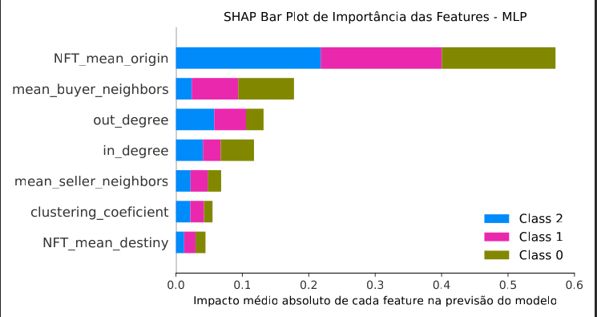

# Análise Preditiva de NFTs: Um Estudo de Redes de Transações e Aprendizado de Máquina

Este projeto de pesquisa explora a relação entre a posição estrutural de um vendedor em uma rede de transações e a precificação futura de seus NFTs. Utilizando um pipeline de aprendizado de máquina supervisionado, o estudo visa classificar NFTs em quartis de valor (Low, Mid, High) com base em métricas de rede extraídas de transações históricas. A metodologia empregada oferece uma abordagem transparente e replicável para compreender a relevância da estrutura da rede na valoração de ativos digitais, em contraste com a subjetividade e falta de critérios claros frequentemente observados no mercado.

> As ferramentas utilizadas para a realização deste projeto foram:
> `sklearn, SHapley Additive exPlanations`

Nossos experimentos foram realizados com as implementações de métodos de regressão da biblioteca _scikit-learn_ da linguagem _Python_ [[Pedregosa et al., 2011]](https://scikit-learn.org/stable/whats_new/v0.24.html). 
- Os métodos de aprendizado de máquina utilizados são:

- _Floresta Aleatória_ (RF)
- _Máquinas de Vetor de Suporte_ (SVM)
- _Multi-layer Perceptron (MLP)_.

## Metodologia

- Pré-processamento de Dados: 
  O conjunto de dados original foi filtrado para incluir apenas NFTs transacionados em 2020 e 2021. As transações foram agrupadas por par (NFT, dono), e métricas de rede (grau de entrada, grau de saída, coeficiente de agrupamento, entre outros) foram calculadas para cada vendedor com base na rede de 2020.

- Definição da Variável-Alvo: 
  O valor futuro dos NFTs, representado por seu preço médio de venda em 2021, foi dividido em quartis (Low, Mid, High) para criar a variável de classe (y). Essa divisão foi realizada utilizando o módulo percentile disponivel na biblioteca `pandas`.

- Modelagem e Classificação: 
  Três modelos de aprendizado de máquina supervisionado foram empregados para a classificação:

    - Random Forest Classifier
    - Support Vector Machine (SVM)
    - Multi-layer Perceptron (MLP)

- Avaliação: 
  A performance dos modelos foi avaliada com base em métricas como Acurácia, Precisão Macro, Recall Macro e F1-Score Macro.

- Interpretabilidade: 
  A biblioteca SHAP (Shapley additive explanations) foi utilizada para interpretar as previsões dos modelos e identificar a contribuição de cada feature.

## Resultados
Na tabela a seguir apresentamos os resultados das métricas aplicadas aos modelos implementados e treinados.

**Tabela 1. Desempenho do modelos avaliados com as métricas Precisão (P), Revocação (R), F1-score (F1), Acurácia (Acc) e F1-macro.**
| Métrica          | Quartil         | MLP  | RF   | SVM  |
|------------------|-----------------|------|------|------|
| **Precision**    | Low (Classe 0)  | 0.68 | 0.75 | 0.59 |
|                  | Mid (Classe 1)  | 0.85 | 0.76 | 0.88 |
|                  | High (Classe 2) | 0.58 | 0.66 | 0.47 |
| **Recall**       | Low (Classe 0)  | 0.81 | 0.77 | 0.76 |
|                  | Mid (Classe 1)  | 0.71 | 0.74 | 0.66 |
|                  | High (Classe 2) | 0.77 | 0.68 | 0.83 |
| **F1-Score**     | Low (Classe 0)  | 0.74 | 0.76 | 0.66 |
|                  | Mid (Classe 1)  | 0.77 | 0.75 | 0.75 |
|                  | High (Classe 2) | 0.66 | 0.67 | 0.60 |
| **Acurácia**     |                 | 0.74 | 0.73 | 0.70 |
| **F1-Score Glob**|                 | 0.72 | 0.72 | 0.67 |

Os resultados apresentados na Tabela 1 indicam que MLP apresentou a maior acurácia (0,74), seguido de perto por RF (0,73) e por SVM (0,70). O F1-Score global foi idêntico para MLP e RF (0,72), superando o SVM (0,67). Considerando as métricas por classe, observa-se que o MLP manteve um desempenho equilibrado: alcançou a maior precisão para a classe de preço Médio (0,85), obteve a maior revocação para a classe de preço baixo (0,81) e bom desempenho para a classe de preço Alto. Com base nisso, para este projeto optou-se por seguir com a análises mais detalhadas com o modelo MLP devido à sua melhor performance geral em comparação aos demais modelos.

### Métrica Mais Influente
  
A análise SHAP revelou que a métrica NFT_mean_origin (o preço médio dos NFTs vendidos por um usuário) foi a feature mais relevante para as previsões do modelo, validando a hipótese de que o histórico de transações de um nó é um forte indicador de valor.

## Requisitos

Para executar o código deste repositório, você precisará das seguintes bibliotecas 
Python. Elas podem ser instaladas via pip:

  ` pip install pandas numpy scikit-learn matplotlib seaborn openpyxl shap`

### Como Usar

Para reproduzir os resultados:

- Clone este repositório para a sua máquina local.

- Certifique-se de que os arquivos de dados estejam no mesmo diretório.

- Abra o notebook models.ipynb no Jupyter ou em um ambiente de sua preferência.

- Execute.

# Autores
Nara Raquel Dias Andrade 

Oscar Willian 